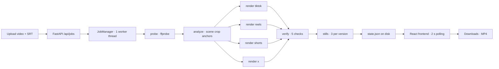

# Edit Once — Publish Everywhere

A platform-correct short-form video repacker for the Social Media Automation Hackathon.

Upload **one** finished short (clean, no burned-in captions) + its SRT caption file.
The app re-renders captions into each platform's safe zone, converts any input ratio to
9:16 @ 1080×1920 with smart-ish anchored cropping, and shows a side-by-side results grid
with a **PASS/FAIL rule checklist proving each version is platform-correct**. Downloads of
each MP4.

**The product is a correctness guarantee, not an auto-clipper.** Captions are re-rendered
from the SRT — never OCR'd. Automation by default; a manual crop-anchor override is the
only human input (escape hatch, not the workflow).

## Why this exists

Creators edit one short for TikTok, then discover Reels needs captions higher (heavier
bottom UI), Shorts has a like/comment rail on the right, X has different limits — so they
re-edit 3–4 times. Repurpose.io/Opus Clip/Klap *re-cut* your video (you lose control);
this product **repacks your edit and verifies platform-correctness**. Control + verification
is unserved for solo creators.

## Platform rules (the engine)

| Platform | Bottom safe margin | Right safe margin | Caption offset (MarginV) | Duration limit |
|---|---|---|---|---|
| TikTok | 18% | 15% | 410 px | 600 s |
| Instagram Reels | 30% | 15% | 640 px | 180 s |
| YouTube Shorts | 20% | 25% | 448 px | 180 s |
| X | 15% | 10% | 352 px | 140 s |

All values live in [`backend/platforms.json`](backend/platforms.json) — the single source of
truth (PRD FR-3.1). Adding a platform = adding one config entry, nothing else. These are
tunable presets, not law: Reels' bottom UI is the heaviest (caption bar + icons → largest
bottom margin), Shorts has the right-side rail (largest right margin), X has the lightest UI.

## Architecture



- **Backend** — Python 3.11+ / FastAPI, ffmpeg (libass) + OpenCV as subprocesses, no
  database, no external APIs (fully offline demo).
- **Frontend** — Vite + React + TypeScript, dark video-first design, hand-rolled design tokens.
- **Pipeline** — `probe → analyze → render → verify → stills`, one render at a time
  globally, per-version state persisted to `data/jobs/{id}/state.json`.

Key modules (clean boundaries, unit-tested):

| Module | Responsibility |
|---|---|
| `backend/app/pipeline/ass.py` | SRT/VTT parser (line-numbered errors) + per-platform ASS generator |
| `backend/app/pipeline/rules.py` | `platforms.json` loader + margin/crop/wrap math |
| `backend/app/pipeline/renderer.py` | ffmpeg command builder/runner (timeout, progress, stderr) |
| `backend/app/pipeline/verifier.py` | resolution/ratio/captions_safe/audio/duration checks |
| `backend/app/queue.py` | JobManager: queue, worker, state persistence |

## Run it

```bash
./scripts/setup.sh    # system deps (ffmpeg+libass), venv, npm build, fixtures
./scripts/run.sh      # uvicorn on http://localhost:8000 (serves the built frontend)
```

For development: `cd frontend && npm run dev` (Vite on :5173, proxies /api → :8000).

## Verify it

```bash
cd backend && ../.venv/bin/pytest          # unit + API tests (87% coverage)
./scripts/demo.sh                          # scripted E2E: fixture → 4 MP4s → checklist table
```

The deterministic fixture (`backend/tests/fixtures/make_fixture.py`) generates a 30 s
1080×1920 clip with a moving subject + sine audio and an 8-cue SRT — no internet needed.

## The verification checklist (the differentiator)

| Check | PASS | WARN | FAIL |
|---|---|---|---|
| resolution | exactly 1080×1920 | ≥ 720×1280 | below min |
| ratio | ≈ 9:16 | — | off-ratio |
| captions_safe | caption box inside platform safe rect | line truncated with "…" | box outside safe rect |
| audio | stream present | — | no audio in source |
| duration | ≤ platform limit | exceeds limit (shows number) | — |

A failed platform render never fails the job — that platform shows the stderr tail while the
others continue. Every error surfaces in the UI with specifics (SRT errors name the line).

## Demo script (2–4 min submission)

1. "I edit one short for TikTok — then I have to re-edit it for Reels, Shorts, and X. This
   repacks it for all four, correctly."
2. Upload video + SRT → 4 progress bars.
3. Results: 4 versions side by side; toggle the safe-zone overlay — TikTok low, Reels
   raised (~230 px), Shorts clear of the right rail.
4. Checklist: all PASS. The repositioning is *visible* (pixel-verified: Reels captions sit
   230 px higher than TikTok's).
5. Download one. "Automation by default, control when it's wrong."

## Status

- [x] M1 backend skeleton (queue, probe, upload validation, health)
- [x] M2 single-platform render (ASS → ffmpeg → verify)
- [x] M3 all 4 platforms + stills + downloads + checklists
- [x] M4 frontend + setup/run/demo scripts (E2E green)
- [ ] Day 2: face anchor, manual crop override, blur-pad, batch, YouTube upload (priority order)

## License

MIT — see [LICENSE](LICENSE). Bundled font: Inter (SIL Open Font License).