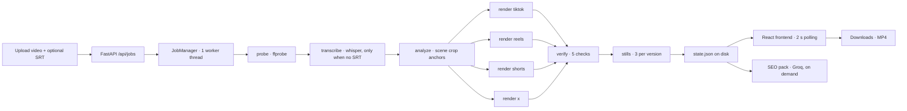

# Edit Once — Publish Everywhere

A platform-correct short-form video repacker for the Social Media Automation Hackathon.

Upload **one** finished short (clean, no burned-in captions) + an optional SRT caption file.
The app re-renders captions into each platform's safe zone, converts any input ratio to
9:16 @ 1080×1920 with smart anchored cropping (auto face-detected, manual override), and
shows all four versions in a single-row results grid — play any preview fullscreen or
download each MP4. Every version is verified against its platform spec before it's marked
Ready; failed versions surface the renderer stderr instead.

**No SRT? No problem.** Captions are optional — upload a video alone and captions are
transcribed locally from the audio (faster-whisper, no API keys); upload an SRT to keep
full control. Either way, captions are re-rendered from an SRT file — never OCR'd.

**Ready to post? Generate an SEO pack.** Once your versions render, one click asks Groq
for platform-optimized titles, descriptions, and viral hashtags for all four platforms —
grounded in what your video actually says (its transcript), editable, and copyable per
field or as a full pack. Optional: set `EDITONCE_GROQ_API_KEY` in `.env` to enable it.

**The product is a correctness guarantee, not an auto-clipper.** Captions are re-rendered
from the SRT — never OCR'd. Automation by default; a manual crop-anchor override is the
only human input (escape hatch, not the workflow).

## Why this exists

Creators edit one short for TikTok, then discover Reels needs captions higher (heavier
bottom UI), Shorts has a like/comment rail on the right, X has different limits — so they
re-edit 3–4 times. Repurpose.io/Opus Clip/Klap *re-cut* your video (you lose control);
this product **repacks your edit and verifies platform-correctness**. Control + verification
is unserved for solo creators.

## Platform rules (the engine)

| Platform | Bottom safe margin | Right safe margin | Caption offset (MarginV) | Duration limit |
|---|---|---|---|---|
| TikTok | 18% | 15% | 410 px | 600 s |
| Instagram Reels | 30% | 15% | 640 px | 180 s |
| YouTube Shorts | 20% | 25% | 448 px | 180 s |
| X | 15% | 10% | 352 px | 140 s |

All values live in [`backend/platforms.json`](backend/platforms.json) — the single source of
truth (PRD FR-3.1). Adding a platform = adding one config entry, nothing else. These are
tunable presets, not law: Reels' bottom UI is the heaviest (caption bar + icons → largest
bottom margin), Shorts has the right-side rail (largest right margin), X has the lightest UI.

## Architecture



- **Backend** — Python 3.11+ / FastAPI, ffmpeg (libass) + OpenCV as subprocesses, no
  database; fully offline by default — the optional Groq key is the only external API.
- **Frontend** — Vite + React + TypeScript, dark aurora-glass design (hand-rolled tokens,
  Inter Variable, lucide icons), Framer Motion primitives (`Reveal`, `Stagger`, `Shine`),
  skeleton loaders, fullscreen 9:16 video modal, responsive 4-up results grid.
- **Accessibility** — WCAG-AA contrast (secondary text ≈7.4:1), `aria-busy`/`role=alert`
  live regions, `:focus-visible` rings so keyboard focus never relies on color alone, and
  `prefers-reduced-motion` support that collapses all animations.
- **Pipeline** — `probe → analyze → render → verify → stills`, one render at a time
  globally, per-version state persisted to `data/jobs/{id}/state.json`.

Key modules (clean boundaries, unit-tested):

| Module | Responsibility |
|---|---|
| `backend/app/pipeline/ass.py` | SRT/VTT parser (line-numbered errors) + per-platform ASS generator |
| `backend/app/pipeline/rules.py` | `platforms.json` loader + margin/crop/wrap math |
| `backend/app/pipeline/renderer.py` | ffmpeg command builder/runner (timeout, progress, stderr) |
| `backend/app/pipeline/verifier.py` | resolution/ratio/captions_safe/audio/duration checks |
| `backend/app/queue.py` | JobManager: queue, worker, state persistence |

## Run it

```bash
./scripts/setup.sh    # system deps (ffmpeg+libass), venv, npm build, fixtures
./scripts/run.sh      # uvicorn on http://localhost:8000 (serves the built frontend)
```

For development: `cd frontend && npm run dev` (Vite on :5173, proxies /api → :8000).

## Verify it

```bash
cd backend && ../.venv/bin/pytest          # unit + API tests (113 tests)
cd frontend && npx tsc --noEmit && npm run build   # typecheck + production build
```

The deterministic fixture (`backend/tests/fixtures/make_fixture.py`) generates a 30 s
1080×1920 clip with a moving subject + sine audio and an 8-cue SRT — no internet needed.
Caption transcription uses faster-whisper (`base` model) entirely offline; `scripts/setup.sh`
pre-downloads it once so transcription never touches the network.

## The verification checklist (the differentiator)

Verification runs in the engine after every render; a version only shows as Ready once its
checks pass. A failed platform render never fails the job — that platform's card shows a
collapsible stderr tail while the others continue. Every error surfaces in the UI with
specifics (SRT errors name the line).

| Check | PASS | WARN | FAIL |
|---|---|---|---|
| resolution | exactly 1080×1920 | ≥ 720×1280 | below min |
| ratio | ≈ 9:16 | — | off-ratio |
| captions_safe | caption box inside platform safe rect | line truncated with "…" | box outside safe rect |
| audio | stream present | — | no audio in source |
| duration | ≤ platform limit | exceeds limit (shows number) | — |

## Recent polish

- **Memoized toolchain health** — the health endpoint used to spawn two subprocesses
  (`ffmpeg -version`, `-filters`) per call; it's now cached with a 30 s TTL, making the
  check O(1) after the first call. The binary's features can't change mid-process, so the
  cache is always correct.
- **O(n) caption truncation** — the "…" ellipsis path previously re-scanned and re-copied
  the line per dropped character (O(n²) worst case); it now tracks text width incrementally
  in a single pass.
- **Skeleton loaders for SEO packs** — 4 LLM calls take seconds; shimmering placeholder
  cards hold the grid stable (zero layout shift) during first generation and regeneration.
- **Keyboard-first controls** — crop-anchor dragging has a full keyboard equivalent
  (arrows nudge 5%), modals close on Escape, and every copy/regenerate control gets a
  visible `:focus-visible` ring.

## License

MIT — see [LICENSE](LICENSE). Bundled font: Inter (SIL Open Font License).