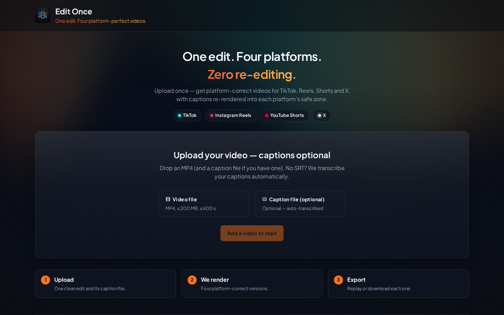
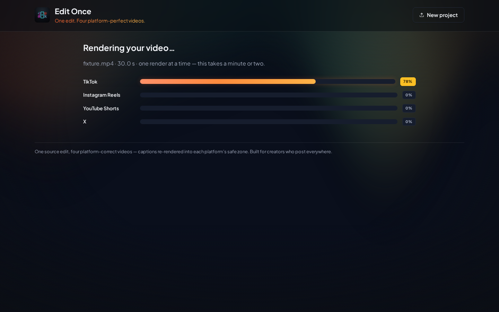
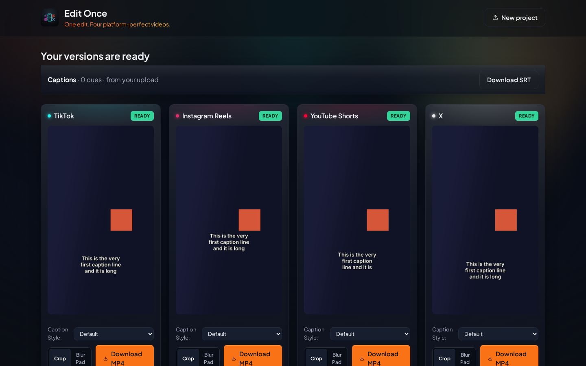
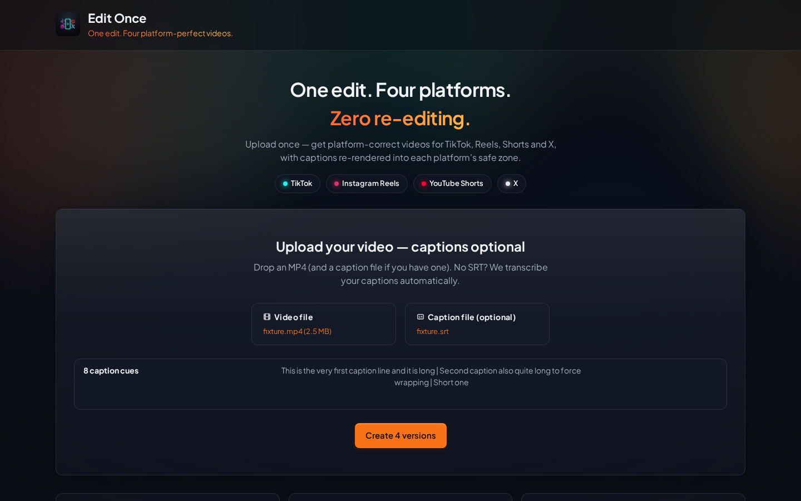
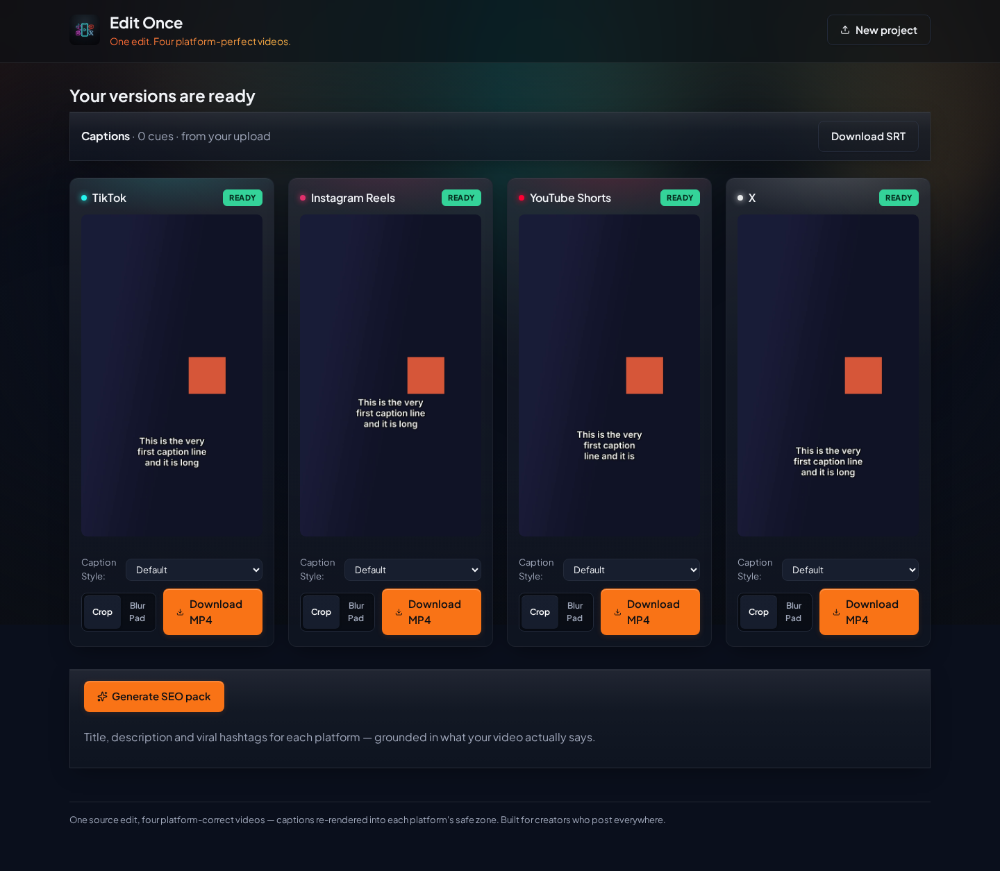
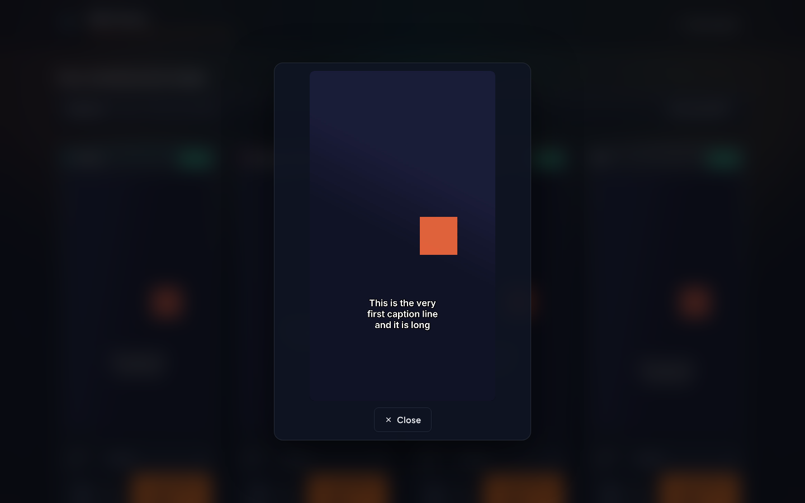
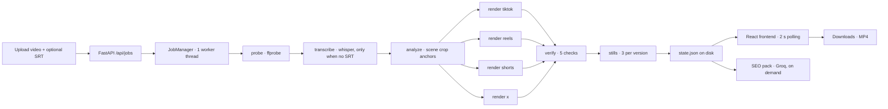

<div align="center">

# ✂️ Edit Once — Publish Everywhere

**One source edit. Four platform-correct videos. Zero re-editing.**

Upload a finished short + an optional caption file — get back TikTok, Reels, Shorts & X versions with captions re-rendered into each platform's safe zone, verified correct before they're marked Ready.

[](backend/requirements.txt)
[](backend/app/main.py)
[](frontend/package.json)
[](backend/tests)
[](LICENSE)

[Quick Start](#-quick-start--5-minutes) · [How It Works](#-how-it-works) · [Configuration](#%EF%B8%8F-configuration--parameters) · [Usage Examples](#-usage-examples) · [Gotchas](#-edge-cases--gotchas) · [API Reference](#-api-reference)

</div>

---

## 👀 What is this?

You edited the perfect short for TikTok. Then you discover:

- **Reels** buries your captions under its bottom UI bar
- **Shorts** covers the right side with its like/comment rail
- **X** has different duration limits entirely

So you re-edit the same video 3–4 times. Every time.

**Edit Once fixes that.** It's not an auto-clipper (like Opus Clip / Klap that re-cut your footage and take away control). It's a **correctness guarantee**:

1. You bring your finished edit — a clean video with **no burned-in captions** + an optional `.srt` / `.vtt` file.
2. It converts any ratio to **9:16 @ 1080×1920** with smart anchored cropping (face-detected, manually overridable).
3. It **re-renders your captions from the SRT** into each platform's safe zone via libass — never OCR'd, never pixel-moved.
4. It **verifies every version** (resolution, ratio, caption safety, audio, duration) before marking it Ready.
5. Optionally, it writes you an **SEO pack** — per-platform titles, descriptions & hashtags grounded in what your video actually says.

> **Automation by default, control when it's wrong.** The only manual input is an optional crop-anchor override — an escape hatch, not the workflow.

---

## ✨ Screenshots

| Upload | Running | Results |
|---|---|---|
|  |  |  |

| Caption-aware upload | Full results + SEO pack | Fullscreen preview |
|---|---|---|
|  |  |  |

*Screenshots captured running the deterministic offline fixture (video + SRT, no external services).*

---

## 🚀 Quick Start — 5 minutes

**Prerequisites:** Linux/macOS, `python3`, `node` + `npm`, `ffmpeg` with libass.

```bash
# 1. Install everything (system deps, venv, frontend build, fixtures, whisper model)
./scripts/setup.sh

# 2. Run it — app serves at http://localhost:8000
./scripts/run.sh
```

Open **http://localhost:8000**, drop in a video (+ optional SRT), and watch 4 platform cards render.

**For frontend development** (hot reload on `:5173`, proxies `/api` → `:8000`):

```bash
cd frontend && npm run dev
```

**Verify your install:**

```bash
cd backend && ../.venv/bin/pytest          # 117 unit + API tests
cd frontend && npx tsc --noEmit && npm run build   # typecheck + production build
./scripts/demo.sh                          # scripted end-to-end: upload fixture → 4 MP4s → checklist table
```

---

## 🧩 How It Works



**Pipeline stages** — `probe → transcribe? → analyze → render → verify → stills`:

| Stage | What happens |
|---|---|
| `probe` | `ffprobe` reads width, height, duration, fps, audio presence |
| `transcribe` | *Only if you skipped the SRT.* Local `faster-whisper` (`base`, CPU int8 + VAD) writes `in.srt`, then the pipeline continues unchanged |
| `analyze` | Samples ~1 frame / 2 s, runs OpenCV Haar face detection, groups detections into per-scene crop anchors. No face anywhere → center anchor (logged, never fails) |
| `render` | Per platform, sequentially (1 globally): anchored crop → `scale=1080:1920` → burn ASS captions → H.264 + AAC + `faststart` |
| `verify` | 5 checks per version — only `done` versions with passing checks show as Ready |
| `stills` | 3 JPEGs per version, snapped into caption cues when possible (first cue + 40% + 80% of duration) |

**Key design decisions:**

- **No database.** Job state lives at `data/jobs/{id}/state.json` — restarts don't lose jobs.
- **Fully offline core.** `ffmpeg` + OpenCV + libass. The only network call in the entire product is the *optional* Groq SEO pack.
- **One render at a time globally** (`RENDER_CONCURRENCY = 1`). Predictable on a laptop, queue everything else.

---

## 🎬 Features

- **📤 One upload, four exports** — any input ratio in, 9:16 1080×1920 H.264 MP4s out, with AAC audio + `faststart` for browser playback.
- **💬 Captions, your way** — per-version style picker (re-rendered through libass):
  | Style | Look |
  |---|---|
  | `default` | White + black outline |
  | `karaoke` | Word-by-word `{\k}` timing sweep (yellow → white) |
  | `pop` | Red fill, white outline, bold |
  | `bold` | Green-tinted, heavy border |
- **✂️ Long cues never lost** — multi-word cues split into sequential timed chunks; nothing silently dropped.
- **🎯 No SRT? No problem** — video-only uploads are transcribed locally (no API keys). Bring an SRT to keep full control.
- **🔍 SEO pack on demand** — one click asks Groq (`llama-3.3-70b-versatile`) for per-platform titles, descriptions & hashtags grounded in your transcript. Editable, copyable per field or as a full pack.
- **🖼️ Side-by-side proof** — 4-up results grid with stills, safe-zone SVG overlay toggle, PASS/WARN/FAIL checklist, fullscreen 9:16 modal, per-file download.
- **🔧 Escape hatches** — per-version crop/blur fit, manual anchor override (normalized `0..1`), and caption-template switch — each re-renders **only that platform**.
- **♿ Accessible & calm** — WCAG-AA contrast (~7.4:1), `aria-busy` / `role=alert` live regions, `:focus-visible` rings, `prefers-reduced-motion` support, focus-trapped modal.

---

## 📐 Platform Rules (the engine)

All values live in [`backend/platforms.json`](backend/platforms.json) — the **single source of truth**. Adding a platform = adding one config entry, nothing else.

| Platform | Bottom safe margin | Right safe margin | Caption offset (MarginV) | Duration limit |
|---|---|---|---|---|
| TikTok | 18% | 15% | 410 px | 600 s |
| Instagram Reels | 30% | 15% | 640 px | 180 s |
| YouTube Shorts | 20% | 25% | 448 px | 180 s |
| X | 15% | 10% | 352 px | 140 s |

*Why these numbers?* Reels has the heaviest bottom UI (caption bar + icons → largest bottom margin). Shorts has the right-side like/comment rail (largest right margin). X has the lightest UI (smallest margins). These are **tunable presets, not law** — the point is the engine.

> **ASS generation** (per platform): `PlayRes 1080×1920`, `Alignment 2` (bottom-center), `WrapStyle 2`, `MarginV = round(bottom_margin × 1920) + font_size`, `MarginL/R = round(right_margin × 1080)`, font `Inter SemiBold 64`, wrap at 18 chars/line (latin ≈ 0.5× font size, CJK ≈ 1.0×), max 3 lines.

---

## ⚙️ Configuration & Parameters

### 1. Environment variables (`.env`)

Copy [`.env.example`](.env.example) to `.env`. Everything is optional — the core pipeline runs with **zero keys**:

| Variable | Default | What it does |
|---|---|---|
| `EDITONCE_GROQ_API_KEY` (or `GROQ_API_KEY`) | — | Enables the on-demand SEO pack. Without it, `POST /seo` returns `503` with a clear message |
| `EDITONCE_GROQ_MODEL` | `llama-3.3-70b-versatile` | LLM used for titles/descriptions/hashtags |
| `EDITONCE_GROQ_TIMEOUT_S` | `30` | Seconds before a Groq call fails over to a per-platform error (other platforms still succeed) |
| `EDITONCE_WHISPER_MODEL` | `base` | Local transcription model (`tiny` = faster, `small`/`medium` = more accurate). SRT uploads skip it entirely |
| `EDITONCE_DATA_DIR` | `backend/data` | Where `jobs/{id}/` state lives. Tests override this to avoid polluting real jobs |

> `.env` is loaded from **both** the repo root and `backend/` (root wins). Never commit secrets — `.env` is gitignored.

### 2. Upload & pipeline limits (`backend/app/config.py`)

| Parameter | Value | Behavior on violation |
|---|---|---|
| `MAX_UPLOAD_BYTES` | 200 MB | `413` — checked per 1 MB chunk, so oversized uploads fail early without buffering in RAM |
| `MAX_DURATION_S` | 600 s | `422` with the actual duration (e.g. `Video duration 612.4s exceeds the 600 s limit`) |
| `MAX_CUES` | 2000 cues | `422` naming the limit |
| `ALLOWED_VIDEO_EXTS` | `.mp4` only | `422 — Video must be an .mp4 file` |
| `ALLOWED_CAPTION_EXTS` | `.srt`, `.vtt` | `422 — Caption file must be .srt or .vtt` (VTT headers + `NOTE` blocks auto-stripped) |
| `RENDER_CONCURRENCY` | `1` | One ffmpeg render globally; jobs queue behind it |
| `FFMPEG_TIMEOUT_FACTOR` | `2.0×` | Hard timeout = 2× expected duration; stderr captured for the UI |
| `RENDER_PRESET` / `RENDER_CRF` | `veryfast` / `20` | Laptop-friendly speed/quality tradeoff; outputs ≤60 s per 30 s clip |
| `POLL_INTERVAL_S` | `2.0 s` | Frontend polls `GET /api/jobs/{id}` every 2 s while running |

### 3. Per-version options (`PUT /api/jobs/{id}/versions/{platform}/options`)

| Field | Type | Default | What it does |
|---|---|---|---|
| `fit` | `"crop"` \| `"blur"` | `"crop"` | `crop` = largest centered/anchored 9:16 window. `blur` = blurred background pad for extreme ratios (input wider than 4:3 or unusually tall) |
| `anchor` | `[x, y]` normalized `0..1` \| `null` | `null` (auto) | Manual crop-anchor override (FR-4.3). Re-renders **only that platform** — the other three are untouched |
| `caption_template` | `"default"` \| `"karaoke"` \| `"pop"` \| `"bold"` | `"default"` | Caption style, re-rendered per platform through libass |

---

## 💡 Usage Examples

### A. Upload video + SRT (the happy path)

```bash
curl -s -F "video=@my-short.mp4" -F "srt=@captions.srt" \
  http://localhost:8000/api/jobs
# → {"job_id":"a1b2…","cues":24,"captions":"uploaded"}
```

### B. Video-only — auto-transcribe locally

```bash
curl -s -F "video=@my-short.mp4" http://localhost:8000/api/jobs
# → {"job_id":"c3d4…","cues":0,"captions":"auto"}
# Poll shows status "transcribing" (with transcribe_progress 0–100), then "rendering" → "done".
# Fetch the generated captions any time:
curl -O http://localhost:8000/api/jobs/c3d4…/captions  # saves captions.srt
```

### C. Poll a job + download results

```bash
JOB=a1b2…
watch -n 2 "curl -s http://localhost:8000/api/jobs/$JOB | python3 -m json.tool | head -40"

# When status is "done", download each version:
for p in tiktok reels shorts x; do
  curl -OJ http://localhost:8000/api/jobs/$JOB/versions/$p
done
# → a1b2_tiktok.mp4, a1b2_reels.mp4, … (Content-Disposition: attachment)
```

### D. Python — upload, wait, download

```python
import time, httpx

base = "http://localhost:8000"
with open("my-short.mp4", "rb") as v, open("captions.srt", "rb") as s:
    job = httpx.post(f"{base}/api/jobs",
                     files={"video": v, "srt": s}).json()["job_id"]

while True:
    state = httpx.get(f"{base}/api/jobs/{job}").json()
    print(state["status"], {p: v["status"] for p, v in state["versions"].items()})
    if state["status"] in ("done", "failed"):
        break
    time.sleep(2)

for platform in ("tiktok", "reels", "shorts", "x"):
    mp4 = httpx.get(f"{base}/api/jobs/{job}/versions/{platform}")
    if mp4.status_code == 200:
        open(f"out_{platform}.mp4", "wb").write(mp4.content)
```

### E. JavaScript — upload + live progress (what the frontend does)

```ts
import { uploadJob, pollJob } from "./api";

const { job_id } = await uploadJob(videoFile, srtFile /* or null */);
await pollJob(job_id, (state) => {
  // called every 2 s — update progress bars, then render the 4-up grid
  console.log(state.status, state.versions);
});
```

### F. Re-render one platform (anchor / fit / caption style)

```bash
# Move TikTok's crop anchor left-of-center, switch to blur-pad + karaoke captions:
curl -s -X PUT http://localhost:8000/api/jobs/$JOB/versions/tiktok/options \
  -H "Content-Type: application/json" \
  -d '{"fit":"blur","anchor":[0.25,0.5],"caption_template":"karaoke"}'
# → updated JobState; only tiktok re-renders (status goes back through rendering → done)
```

### G. Generate the SEO pack (requires `EDITONCE_GROQ_API_KEY`)

```bash
curl -s -X POST http://localhost:8000/api/jobs/$JOB/seo | python3 -m json.tool
# → {"packs":{"tiktok":{"title":"…","description":"…","hashtags":["…"]},…},"generated_at":"…"}
# Cached in state.json — re-visits don't re-bill. One platform failing never fails the others.
```

### H. Health check

```bash
curl -s http://localhost:8000/api/health | python3 -m json.tool
# {"ok":true,"ffmpeg":"7.x","libass":true,"fonts":true,"whisper":true,"groq":false}
```

---

## ✅ The Verification Checklist (the differentiator)

Every render is checked by the engine. A version only shows **Ready** once its checks pass. A failed platform never fails the job — its card shows a collapsible stderr tail while the others continue.

| Check | PASS | WARN | FAIL |
|---|---|---|---|
| `resolution` | exactly 1080×1920 | ≥ 720×1280 | below minimum |
| `ratio` | ≈ 9:16 | — | off-ratio |
| `captions_safe` | caption box fully inside the platform safe rect | single over-long word truncated with `…` | box outside safe rect |
| `audio` | stream present | — | no audio in source (render still succeeds!) |
| `duration` | ≤ platform limit | exceeds limit (shows the number) | — |
| `face` | face-anchored crop used | center fallback (no face found) | — |

Every error surfaces in the UI with specifics — SRT errors name the exact line number.

---

## ⚠️ Edge Cases & Gotchas

<details>
<summary><strong>Input files — read this first</strong></summary>

- **Your video must be caption-free.** Burned-in captions can't be moved or removed — the product re-renders captions from the SRT, it never OCRs pixels. The UI and README state this on purpose.
- **Only `.mp4` video is accepted.** `.mov` / `.webm` → `422`. Convert first: `ffmpeg -i in.mov -c copy out.mp4`.
- **Captions: `.srt` or `.vtt` only.** VTT `WEBVTT` headers and `NOTE` blocks are stripped automatically.
- **Encoding quirks handled:** UTF-8 with/without BOM, LF or CRLF line endings, `<i>`/`<b>` inline tags (stripped for measurement), `,` or `.` millisecond separators.
- **Empty video file** → `422 Video file is empty`. **Missing video field** → `422 Missing video file`.
- **Unparseable SRT** → `422 Caption parse error: line N: …` — no job is created, fix that line and retry.
- **>2000 cues** → rejected with a message (split your file or shorten the video).
- **Corrupt/unreadable video** → `422 Could not read video: …` (ffprobe failed).

</details>

<details>
<summary><strong>Duration, size & timing</strong></summary>

- **>600 s video** → `422` with the measured duration. Trim or speed up first.
- **>200 MB upload** → `413`, detected mid-stream (no 200 MB RAM spike).
- **Cue ending after the video ends** → silently clamped to video duration. No error.
- **Overlapping cues** → rendered as-is; last writer wins visually. Sort your SRT if flashes appear.
- **Frame rate is passed through** — never re-encoded to a new fps. Only if ffprobe reports invalid/absent fps does the renderer fall back to 30.
- **Render speed:** ~≤60 s per 30 s clip per platform on a laptop (`veryfast`, CRF 20). Four platforms ≈ ≤4 min. Only **one render runs globally** — parallel uploads queue.

</details>

<details>
<summary><strong>Captions & safe zones</strong></summary>

- **Long cues are split, not cut.** A 5-line cue becomes two sequential timed dialogue chunks. The full text is always visible.
- **Exception:** a *single word* longer than the safe width is truncated with `…` and flagged as `captions_safe = WARN` (not FAIL).
- **CJK text** measures ~1.0× font size per char (latin ~0.5×) — wrapping accounts for this automatically.
- **Reels captions sit highest** (30% bottom margin). If your fixture text hugs the bottom edge, you'll *see* it jump between TikTok and Reels — that's the engine working.
- **Changing `platforms.json` only affects new renders.** Already-rendered versions keep their baked-in captions until you re-render via the options endpoint.

</details>

<details>
<summary><strong>Cropping & faces</strong></summary>

- **Center crop is the default.** Face detection only *moves* the window when it finds a face (~1 sample / 2 s, Haar cascade). No face → center, with a `face = WARN` note. Never a failure.
- **Extreme ratios** (e.g. 16:9 landscape, or tall screenshots): `crop` discards a lot of frame. Switch that version to `fit: "blur"` for a blurred-pad full-frame look.
- **Manual anchor is per-platform.** Fixing TikTok's framing doesn't touch your approved Reels version.
- **After re-render, stills refresh in place at the same URLs** — the API sends `Cache-Control: no-cache` so you never see a stale preview.

</details>

<details>
<summary><strong>Audio, transcription & SEO</strong></summary>

- **Video without audio still renders.** `audio = FAIL (no audio stream in source)` but you still get 4 playable MP4s.
- **Video-only uploads need `faster-whisper`.** If it's not installed, the job fails with a clear message — while SRT uploads keep working fine. Run `./scripts/setup.sh` to pre-download the `base` model (~150 MB) so demo day never touches the network.
- **Transcription is local & lazy.** The whisper import happens inside the worker — the app boots and serves SRT jobs even without the model.
- **SEO needs a finished job + API key.** `POST /seo` before `done` → `409`. No `EDITONCE_GROQ_API_KEY` → `503` with setup instructions. One platform's LLM error never fails the other three (`502` only if *all* fail).

</details>

<details>
<summary><strong>Infra & failure modes</strong></summary>

- **ffmpeg without libass** → `503` on upload + `ok:false` in `/api/health`. Fix: reinstall ffmpeg with libass (`ffmpeg -filters | grep subtitles` must match).
- **Missing bundled font** (`backend/fonts/Inter-SemiBold.ttf`) → `ok:false`. The font must be committed (OFL-licensed).
- **One platform render crashing** (bad codec, corrupt frame) → that card shows `failed` + last 500 chars of stderr. The other three continue. The job is `failed` only if the whole pipeline dies (e.g. analysis crash).
- **Polling an unknown job** → `404 Job not found` → UI returns to upload with a friendly message.
- **Downloading before `done`** → `404 Version not available yet`.
- **OpenCV 5 removed `CascadeClassifier`.** `requirements.txt` pins `opencv-python-headless<5` — don't "upgrade" past it or face detection breaks.

</details>

---

## 🔌 API Reference

Base URL (prod): `http://localhost:8000` · (dev): `http://localhost:5173` proxies `/api` → `:8000`.

| Method & Path | Description |
|---|---|
| `GET /api/health` | `{ok, ffmpeg, libass, fonts, whisper, groq}` — toolchain + capability probe |
| `POST /api/jobs` | Multipart `video` (required) + `srt` (optional) → `201 {job_id, cues, captions: "uploaded"\|"auto"}` |
| `GET /api/jobs/{id}` | Full `JobState` — poll every 2 s while `queued\|transcribing\|analyzing\|rendering` |
| `PUT /api/jobs/{id}/versions/{platform}/options` | `{fit, anchor, caption_template}` → re-renders only that platform |
| `GET /api/jobs/{id}/versions/{platform}` | MP4 download (`attachment`, `video/mp4`) — `404` until `done` |
| `GET /api/jobs/{id}/stills/{platform}/{n}` | JPEG still `n ∈ {0,1,2}` — `404` when missing |
| `GET /api/jobs/{id}/captions` | `captions.srt` (uploaded or auto-transcribed) |
| `POST /api/jobs/{id}/seo` | Groq SEO packs for all 4 platforms (cached in `state.json`) |

**Status flows** — job: `queued → transcribing? → analyzing → rendering → done | failed` · version: `queued → rendering (progress 0–100) → done | failed`.

<details>
<summary><strong>Error status codes</strong></summary>

| Code | When |
|---|---|
| `404` | Unknown job, version not done yet, still/caption file missing |
| `409` | SEO requested before job `done`, or no captions to ground it |
| `413` | Video exceeds 200 MB |
| `422` | Missing/empty video, wrong extension, bad SRT (with line number), unreadable video, duration >600 s |
| `502` | All 4 SEO generations failed (per-platform errors otherwise) |
| `503` | ffmpeg/libass missing, or Groq key not configured |

</details>

---

## 🧪 Testing

```bash
cd backend && ../.venv/bin/pytest          # 117 tests: srt, ass, rules, verifier, transcriber, api
cd frontend && npx tsc --noEmit && npm run build
```

- **Deterministic fixture** (`backend/tests/fixtures/make_fixture.py`): 30 s 1080×1920 clip with moving subject + sine audio, 8-cue SRT, plus a 16:9 variant for crop-path tests. No internet needed.
- **Golden ASS tests** assert exact `Style`/`Dialogue` lines per platform (MarginV, `\N` wrapping, truncation).
- **AC-9 face test:** fixture with a left-third face → crop window lands left-of-center, not centered.

---

## 🗂️ Project Structure

```
├── backend/
│   ├── app/
│   │   ├── main.py            # FastAPI routes + static mount + upload handling
│   │   ├── config.py          # paths, limits, concurrency, env overrides
│   │   ├── models.py          # JobState / VersionState / CheckResult (Pydantic)
│   │   ├── queue.py           # JobManager: queue, 1-worker thread, state.json
│   │   └── pipeline/          # probe · transcriber · analyzer · rules · ass
│   │                           # renderer · verifier · stills · seo · face
│   ├── platforms.json         # ← single source of truth for all platform rules
│   ├── fonts/                 # Inter SemiBold (OFL, must be committed)
│   ├── tests/ + fixtures/     # pytest suite + deterministic fixture generator
│   └── data/jobs/             # per-job: in.mp4, in.srt, versions/, stills/, state.json
├── frontend/src/
│   ├── App.tsx / api.ts       # upload → poll (2 s) → results flow
│   └── components/            # UploadDropzone · JobProgress · ResultGrid
│                              # PlatformCard · Checklist · SafeZoneOverlay
├── scripts/                   # setup.sh · run.sh · demo.sh (scripted E2E)
├── screenshots/               # upload · running · results · preview
├── PRD.md · PRODUCT.md · edit-once-build.md
└── README.md                  # ← you are here
```

---

## 🛣️ Roadmap

- [x] 4-platform core (probe → render → verify → stills) with PASS checklists
- [x] Face-anchored crop + manual override + blur-pad fit
- [x] Local auto-transcription (video-only uploads)
- [x] Caption templates (default / karaoke / pop / bold) + long-cue splitting
- [x] Groq SEO packs grounded in the transcript
- [ ] Batch mode — N videos → 4N versions in one run (P2)
- [ ] YouTube Shorts direct upload (P2 — cut if auth friction)
- [ ] 720×1280 fallback toggle for weak demo machines

Out of scope by design: OCR of burned-in captions, per-frame face tracking, auto-clipping, scheduling/publishing to TikTok/Reels/X, accounts/auth.

---

## 🤝 Contributing

1. Read [`PRD.md`](PRD.md) §§6–7 (exact engine values + API contract) and [`PRODUCT.md`](PRODUCT.md) (principles).
2. Keep module boundaries clean — one concern per file, pure logic unit-tested.
3. Run `pytest` + `tsc --noEmit` before opening a PR. Nothing above the core line gets sacrificed for garnish.

---

## 📄 License

MIT — see [LICENSE](LICENSE). Bundled font: Plus Jakarta Sans (SIL Open Font License 1.1).

<div align="center">

**Built for creators who'd rather create than re-edit.** ✂️ → 📱📱📱📱

</div>
